# Code Island Buddy

Code Island Buddy 是 Code Island 的 Apple 设备端，包括 iPhone、Dynamic Island / StandBy、Apple Watch app 和 watchOS widget。

它的目标不是做一个新的聊天客户端，而是把 Mac 上 CodeIsland 当前看到的 agent 状态同步到随身设备：你可以在 iPhone 灵动岛和 Apple Watch 上看当前会话、工具调用、最近动态，并在需要时回到 Mac 继续处理。

> [!NOTE]
> 当前代码仍然放在 `ios/CodeIslandCompanion/` Xcode 工程里。这个目录是 Code Island Buddy 的产品说明与截图目录，方便像 `android-watch/` 一样单独阅读和展示。

## 代码位置

| 路径 | 作用 |
| --- | --- |
| `ios/CodeIslandCompanion/CodeIslandCompanion/` | iPhone app 主体 |
| `ios/CodeIslandCompanion/CodeIslandCompanionWidget/` | iPhone Live Activity、Dynamic Island、StandBy UI |
| `ios/CodeIslandCompanion/CodeIslandWatchApp/` | Apple Watch app |
| `ios/CodeIslandCompanion/CodeIslandWatchWidget/` | watchOS Widget / Smart Stack 展示 |
| `ios/CodeIslandCompanion/Shared/` | ActivityKit、Watch、iPhone 共用模型与 mascot 视图 |
| `ios/CodeIslandCompanion/project.yml` | XcodeGen 工程定义 |
| `Sources/CodeIsland/AppleCompanionPublisher.swift` | Mac 端 iPhone Buddy 状态发布 |
| `Sources/CodeIsland/AppleCompanionBluetoothPeripheral.swift` | Mac 端 BLE 后台摘要通道 |
| `Sources/CodeIslandCore/AppleCompanionPayload.swift` | Mac / iPhone / Watch 共用协议模型 |
| `scripts/smoke-companion-ui.sh` | iPhone UI smoke 截图测试 |
| `scripts/smoke-companion-watch-ui.sh` | Apple Watch UI smoke 截图测试 |

## 发布资料

| 路径 | 作用 |
| --- | --- |
| `apple-companion/APP_STORE_RELEASE.md` | App Store / TestFlight 发布清单 |
| `apple-companion/APP_STORE_METADATA.md` | App Store Connect 可复制的名称、描述、关键词、隐私与审核材料 |
| `apple-companion/APP_REVIEW_NOTES.md` | 可粘贴到 App Store Connect 的审核说明 |
| `apple-companion/PRIVACY_POLICY.md` | 隐私政策草稿，发布前需要放到公开 URL |
| `apple-companion/DEVICE_TESTING.md` | iPhone / Apple Watch 真机测试流程 |

## 当前能力

- iPhone 通过本地网络发现 Mac 上的 CodeIsland。
- iPhone 通过 MultipeerConnectivity 接收完整状态并发送操作命令。
- iPhone 通过 CoreBluetooth 接收轻量状态摘要，辅助后台 Live Activity 更新。
- Live Activity 展示 Dynamic Island、锁屏、StandBy 形态。
- Apple Watch 通过 WatchConnectivity 同步 iPhone 当前状态。
- Apple Watch 可查看状态、问题、最近动态，并提供回到 Mac 的入口。

## 通信方案

当前方案刻意保持轻量，不依赖 APNs，也不需要部署后端。

```text
Mac CodeIsland
  ├─ MultipeerConnectivity：前台完整状态、最近动态、操作命令
  └─ CoreBluetooth BLE：后台轻量状态摘要

iPhone Code Island
  ├─ Live Activity / Dynamic Island / StandBy：展示当前状态
  └─ WatchConnectivity：把 iPhone 当前状态同步到 Apple Watch

Apple Watch
  ├─ Watch app：查看当前 agent、问题、最近动态和操作入口
  └─ Smart Stack widget：展示轻量状态
```

### 为什么同时有 Multipeer 和 BLE

MultipeerConnectivity 适合局域网内传完整状态，连接快、实现简单，也方便从 iPhone 给 Mac 发送操作命令。但 iOS app 进入后台后，MultipeerConnectivity 不能作为可靠的长期后台通道：系统可能暂停浏览、广播和会话收发。

BLE 通道只传轻量摘要，例如 agent、状态、当前消息、工作区和少量最近动态。它的目标是让 iPhone 在后台或锁屏时仍有机会被系统唤醒，刷新 Live Activity，并继续把最新状态交给 Apple Watch。它不是一个常驻后台进程，也不保证每一条事件都实时抵达，但比只依赖 Multipeer 更符合 iOS 的后台调度模型。

### Live Activity 的角色

Live Activity、Dynamic Island 和 StandBy 只负责展示状态。它们不会自己连接 Mac，也不能自己长期接收网络事件。状态更新必须来自 iPhone app 本身，或者通过 ActivityKit push。当前方案不使用 APNs，所以后台更新主要依赖 BLE 摘要通道和 iOS 允许的后台唤醒窗口。

## 使用方式

1. 在 Mac 上运行这个 fork 里的 CodeIsland。
2. 打开 CodeIsland 设置，进入 `Buddy`，开启 iPhone Buddy 广播。
3. 在 Xcode 打开 `ios/CodeIslandCompanion/CodeIslandCompanion.xcodeproj`。
4. 在 `Signing & Capabilities` 里给 iPhone app、Widget、Watch app、Watch Widget 都选择你的 Apple Developer Team。
5. 选择 `CodeIslandCompanion` scheme 和你的 iPhone，点击 Run。
6. iPhone 首次启动时允许本地网络、蓝牙、通知权限。
7. 在 iPhone 里选择发现到的 Mac，连接后状态会自动同步。
8. 如果有配对 Apple Watch，iPhone app 安装后 Watch app 会作为随附 app 可安装；调试时也可以在 Xcode 选择 `CodeIslandWatchApp` scheme 直接跑到 Watch。

## 演示模式

iPhone app 首屏提供 `进入演示模式`。它用于 App Store 审核、截图和没有 Mac 时的快速预览：

1. 打开 iPhone app。
2. 点击 `进入演示模式`。
3. 点击 `开启实时活动` 可以预览锁屏、灵动岛和 StandBy。
4. 打开 Apple Watch app，会收到 iPhone 当前演示状态。
5. 点击 `切换演示状态` 可以在提问、处理中、中断、空闲等状态之间切换。

演示模式不会连接外部服务器，也不会发送任何真实会话数据。

## 产品截图

### iPhone App

<table>
  <tr>
    <td align="center"><strong>发现 Mac</strong></td>
    <td align="center"><strong>空闲状态</strong></td>
    <td align="center"><strong>等待提问</strong></td>
  </tr>
  <tr>
    <td>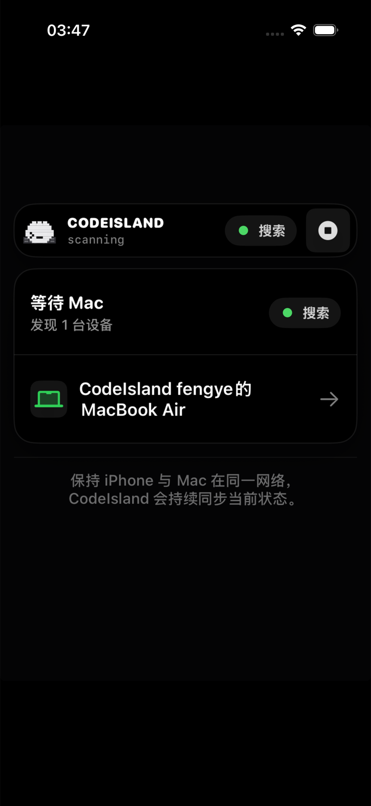</td>
    <td>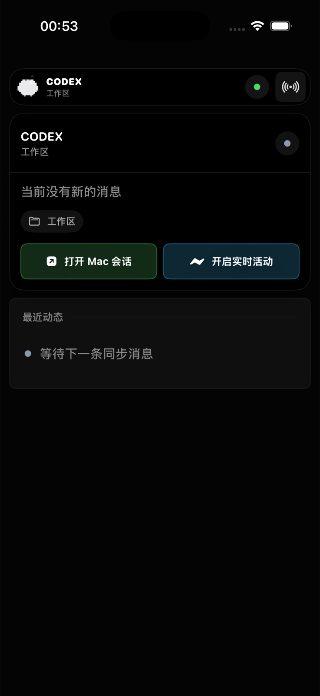</td>
    <td>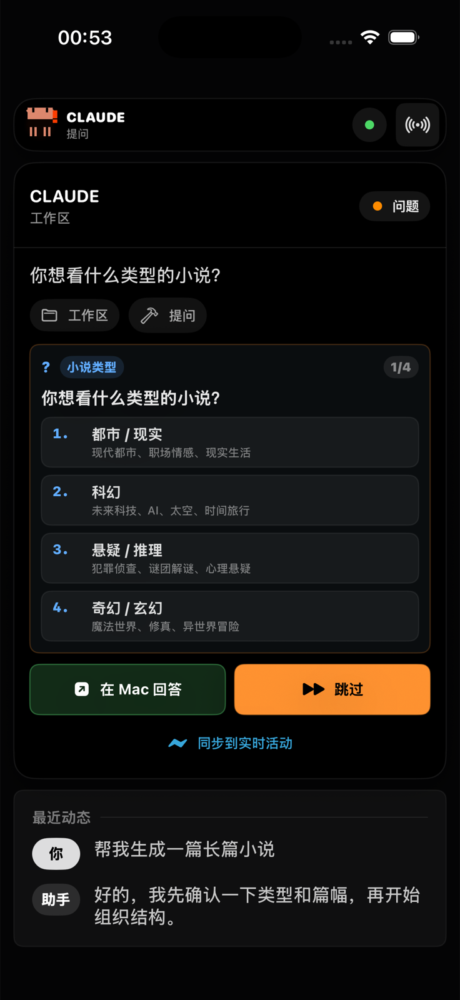</td>
  </tr>
  <tr>
    <td align="center"><strong>长消息</strong></td>
    <td align="center"><strong>请求中断</strong></td>
    <td align="center"><strong>处理状态</strong></td>
  </tr>
  <tr>
    <td>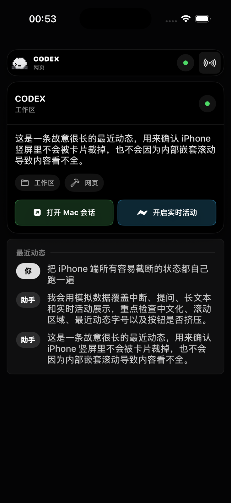</td>
    <td>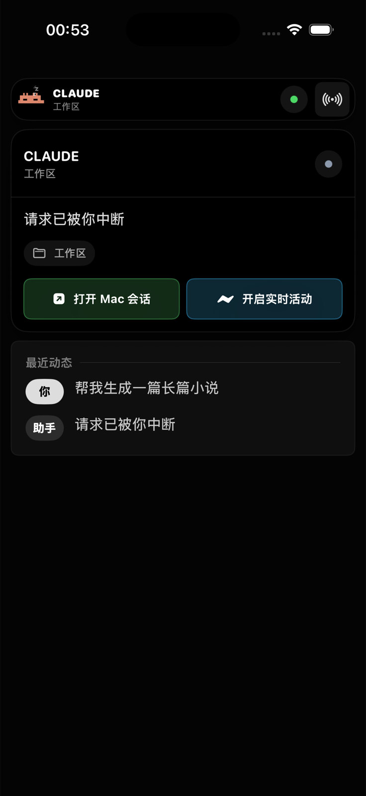</td>
    <td>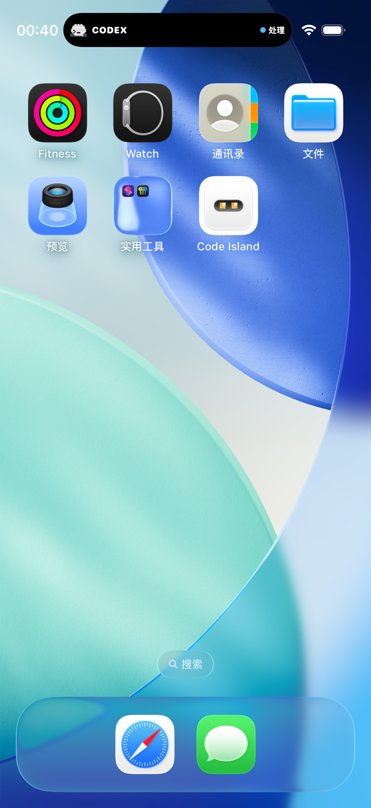</td>
  </tr>
</table>

### Dynamic Island

<table>
  <tr>
    <td align="center"><strong>等待回答</strong></td>
    <td align="center"><strong>处理中</strong></td>
  </tr>
  <tr>
    <td>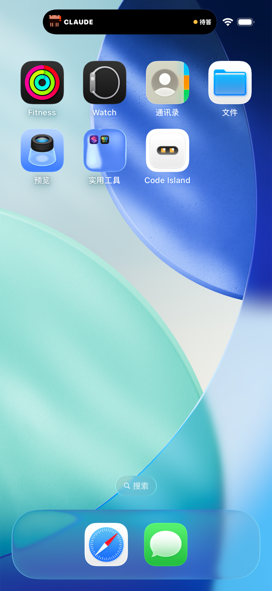</td>
    <td></td>
  </tr>
</table>

### StandBy

<table>
  <tr>
    <td align="center"><strong>横置长消息</strong></td>
  </tr>
  <tr>
    <td>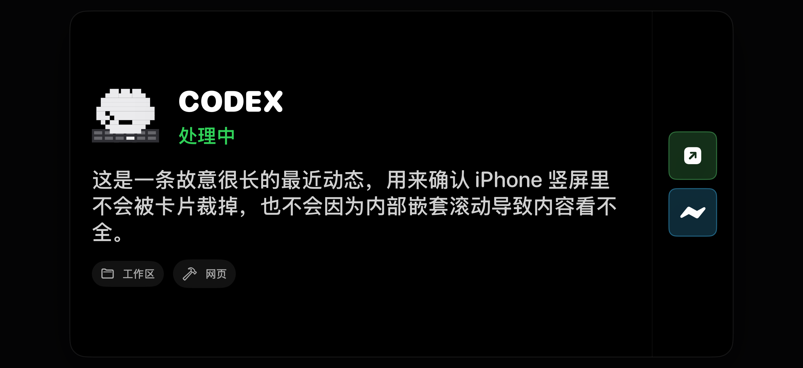</td>
  </tr>
</table>

### Apple Watch 40mm

<table>
  <tr>
    <td align="center"><strong>状态</strong></td>
    <td align="center"><strong>消息 / 提问</strong></td>
  </tr>
  <tr>
    <td>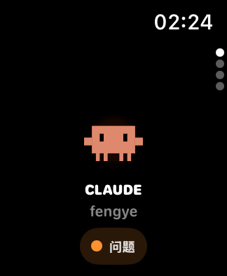</td>
    <td>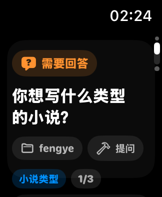</td>
  </tr>
  <tr>
    <td align="center"><strong>操作</strong></td>
    <td align="center"><strong>最近动态</strong></td>
  </tr>
  <tr>
    <td>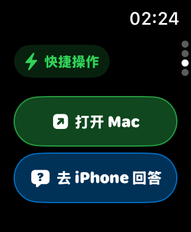</td>
    <td>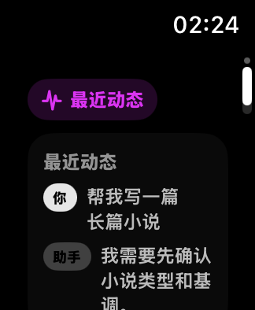</td>
  </tr>
</table>

### Apple Watch 46mm

<table>
  <tr>
    <td align="center"><strong>状态</strong></td>
    <td align="center"><strong>消息 / 提问</strong></td>
  </tr>
  <tr>
    <td>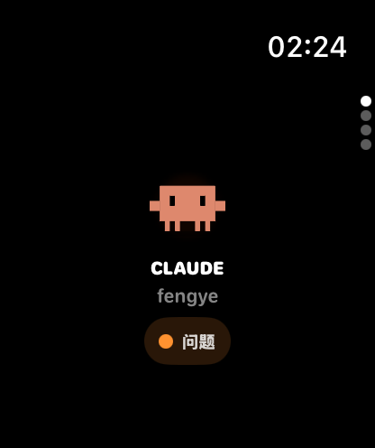</td>
    <td>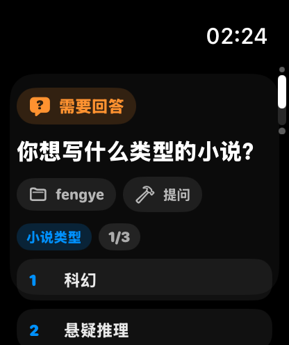</td>
  </tr>
  <tr>
    <td align="center"><strong>操作</strong></td>
    <td align="center"><strong>最近动态</strong></td>
  </tr>
  <tr>
    <td>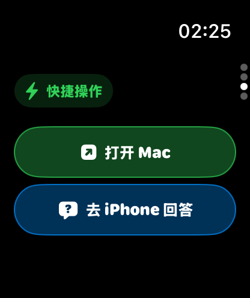</td>
    <td>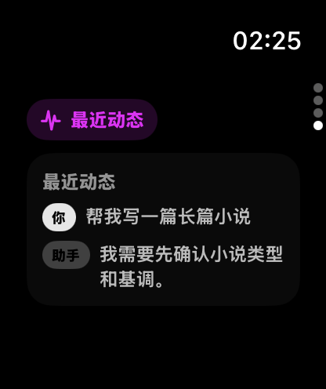</td>
  </tr>
</table>

## 本地验证

```bash
# iPhone 页面 smoke 截图
scripts/smoke-companion-ui.sh

# Watch 页面 smoke 截图
scripts/smoke-companion-watch-ui.sh

# 协议和 UI 回归检查
scripts/check-companion-ui-regressions.sh

# Swift 单元测试
swift test
```

截图会输出到 `.build/`。如果要更新本文档中的产品图，可以先跑 smoke 脚本，再把对应 PNG 覆盖到 `apple-companion/images/`。

## 目前边界

- 不依赖 APNs，也不需要部署后端。
- MultipeerConnectivity 主要用于前台完整同步；iPhone 进入后台较久后，不能保证继续收到完整消息。
- iPhone 被用户从多任务界面强制杀掉后，系统不会保证继续接收事件。
- Live Activity 和 BLE 后台接收受 iOS 调度策略影响，适合作为轻量 Buddy 能力，不等价于常驻后台进程。
- StandBy 是否持续亮屏由 iOS、机型、Always-On Display、低电量模式和睡眠专注决定，app 不能强制保持屏幕常亮。
- Watch 真机震动、通知触达和后台同步仍需要真机验收；模拟器主要用于构建、布局和页面状态验证。
